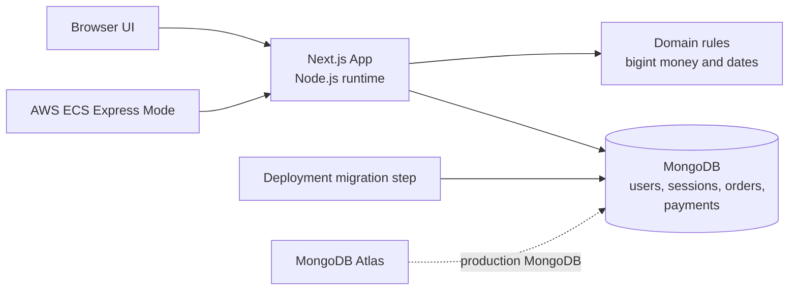
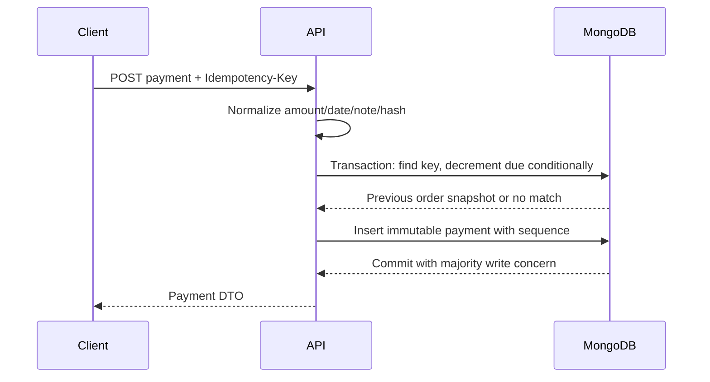

# CrossVal Orders & Settlements

CrossVal is a small, production-minded orders and settlements application. It supports authenticated users, tenant-isolated orders, partial and full payments, immutable payment history, derived order status, and concurrency-safe settlement writes.

The financial rule is simple:

```text
0 <= amountDue <= total
```

The database enforces that rule at the point where money moves. The UI is a client of the HTTP API; it never calculates or persists authoritative financial state.

## Current status

- Local development, MongoDB persistence, authentication, orders, settlements, UI, security hardening, CI, and the production container are implemented.
- The Atlas cluster is provisioned and an immutable image has been pushed to ECR.
- The application is deployed through ECS Express Mode at [the live demo URL](https://cr-fdc41e1a09224299a06a80d64823344c.ecs.ap-south-1.on.aws/orders).
- Deployment follows the ECR → ECS Express Mode flow described in the deployment section below; the current service uses the ARM64 image, container port `3000`, and `/api/health/ready`.

## Architecture



The application uses Next.js route handlers and client components, the native MongoDB driver, and a single process-level `MongoClient`. Database and authentication code stays on the Node.js runtime; it is not moved to Edge runtime.

## Key design decisions

### Money and persistence

- API money values are decimal strings such as `"400.00"`.
- The TypeScript domain uses `bigint`; monetary calculations never use JavaScript floating point.
- MongoDB stores monetary values as BSON signed 64-bit integers representing cents.
- The application business limit is `MAX_MONEY_CENTS = 100_000_000_000n` (`$1B`). The persistence codec is tested separately with a value above `Number.MAX_SAFE_INTEGER` to prove that BSON `Long` does not pass through a JavaScript number.
- API responses serialize money back to decimal strings.

### Order projection versus payment history

An order stores the current settlement projection: `totalCents`, `amountDueCents`, and `paymentCount`. `amountPaid` is derived as `total - amountDue`; `paid` and other statuses are derived rather than persisted.

Payments are immutable historical events. Each payment stores its amount, balance before and after, business-effective `paymentDate`, system `recordedAt`, and aggregate-local `sequence`.

`paymentDate` answers “when did the payment take effect?”; `recordedAt` answers “when did the system record it?”; `sequence` answers “in what order did the aggregate change?” Balances follow sequence, not payment date.

Business dates are calendar dates interpreted in UTC. The server compares due dates and payment dates using `YYYY-MM-DD` values; timestamps such as `recordedAt` remain UTC instants and are formatted by the browser for display.

The aggregate lifecycle is intentionally narrow:

```text
new order
  -> pending or overdue
first payment
  -> partially_paid or paid; editing and deletion become locked
later payment
  -> amountDue decreases; history gains the next sequence
amountDue = 0
  -> paid, regardless of the due date
```

There is no separate persisted `paid` flag, status field, or payment-total counter that can drift from the monetary projection. The persisted `paymentCount` is an aggregate sequencing aid and is checked against the payment history by integration tests.

### Settlement correctness

Settlement performs the conditional balance decrement and payment insert in one MongoDB transaction:



Transactions use primary read preference, snapshot reads, and majority writes. A payment fails when the conditional update cannot reserve enough outstanding balance.

Idempotency and concurrency solve different problems:

| Failure mode | Protection |
| --- | --- |
| Same request delivered twice | User-scoped UUID idempotency key; the request hash binds the key to the order and payload, and replay returns the original payment |
| Same key reused with a different payload | `IDEMPOTENCY_KEY_REUSED` conflict |
| Distinct payments race for the last balance | Conditional `amountDue >= amount` update inside the transaction |
| Stale order edit or delete | Optimistic `version` predicate |
| Edit/delete after settlement begins | `paymentCount = 0` mutation predicate and read-only settled aggregate |

## Data model

| Collection | Purpose | Important fields |
| --- | --- | --- |
| `users` | Account identity | normalized email, Argon2id password hash, timestamps |
| `sessions` | Server-side sessions | hashed token, user ID, expiry; TTL index |
| `orders` | Current aggregate projection | user ID, lines, total cents, amount due cents, payment count, version |
| `payments` | Immutable settlement history | user ID, order ID, sequence, amount cents, idempotency key, request hash, balances, dates |

All user-owned repository queries include the authenticated `userId` predicate. MongoDB validators and unique indexes provide a second persistence boundary in addition to domain validation and service checks.

## Local setup

Prerequisites:

- Node.js 24.18.0 and npm 11
- Docker with Docker Compose

Install and configure the local environment:

```bash
cp .env.example .env.local
npm ci
npm run db:up
npm run db:init
npm run dev
```

The local application runs at [http://localhost:3000](http://localhost:3000). For a different port, set `APP_ORIGIN` to the exact origin and pass the port to Next.js.

The default environment uses a local single-node MongoDB replica set. Transactions require a replica set; a standalone MongoDB process is not sufficient.

To stop local MongoDB:

```bash
npm run db:down
```

For Atlas or another hosted MongoDB deployment, set `MONGODB_URI`, `MONGODB_DATABASE`, and a separate `MONGODB_MIGRATION_URI`. The migration URI is used only by `npm run db:init`; it must not be supplied to the running web application.

## Repository map

```text
src/domain/                 Pure money, dates, clocks, totals, and status rules
src/server/auth/            Passwords, sessions, origin checks, and auth services
src/server/db/              Mongo client, documents, mappers, validators, and repositories
src/server/orders/          Order services and tenant-scoped HTTP context
src/server/settlements/     Transactional payment and idempotency behavior
src/app/api/                Node-runtime route handlers
src/app/components/         Client UI for auth, dashboard, and order detail
tests/unit/                 Framework-independent domain tests
tests/integration/          Real MongoDB replica-set and concurrency tests
scripts/db-init.ts          Deployment/schema initialization entry point
scripts/deploy-smoke.sh     Liveness/readiness deployment check
```

The dependency direction is intentional: domain rules do not import MongoDB or Next.js; repositories translate between domain values and BSON; route handlers translate HTTP input/output and authentication context; React components use only the HTTP API.

## HTTP API

API responses use private, no-store caching and include an `X-Request-Id`. Errors use this envelope:

```json
{
  "error": {
    "code": "INVALID_CREDENTIALS",
    "message": "Invalid email or password.",
    "requestId": "..."
  }
}
```

Schema validation errors add a `details` map keyed by request field (for example, `lines.0.unitPrice`) so clients can show a specific resolution hint without exposing persistence details.

### Authentication

| Method | Endpoint | Result |
| --- | --- | --- |
| `POST` | `/api/auth/signup` | Creates a user and session; `409` for duplicate email |
| `POST` | `/api/auth/login` | Creates a session; `401` for invalid credentials |
| `POST` | `/api/auth/logout` | Revokes the current session and clears the cookie |
| `GET` | `/api/auth/me` | Returns the authenticated user or `401` |

Sessions use an HTTP-only, SameSite cookie. The cookie is secure in production, and only a SHA-256 token hash is persisted.

### Orders

| Method | Endpoint | Result |
| --- | --- | --- |
| `POST` | `/api/orders` | Creates an order; totals are recalculated on the server |
| `GET` | `/api/orders?status=&page=&limit=` | Lists only the current user’s orders, plus pagination and a summary over the full filtered result set |
| `GET` | `/api/orders/:orderId` | Returns one tenant-owned order projection |
| `PATCH` | `/api/orders/:orderId` | Optimistic edit using the required `version` |
| `DELETE` | `/api/orders/:orderId?version=N` | Deletes only an unpaid order at the expected version |

Order status is derived with this precedence: `paid`, `overdue`, `partially_paid`, then `pending`. Once a payment exists, the order becomes read-only.

### Payments

| Method | Endpoint | Result |
| --- | --- | --- |
| `POST` | `/api/orders/:orderId/payments` | Creates a payment or replays the same idempotent request |
| `GET` | `/api/orders/:orderId/payments` | Returns tenant-owned payment history newest-first by sequence |

Payment requests require a UUID `Idempotency-Key` header and a body containing decimal-string `amount`, non-future `paymentDate`, and an optional note. A replay returns `200` with `Idempotency-Replayed: true`; a new payment returns `201`.

Example:

```http
POST /api/orders/665f2b2d6f4f1f3a8c7e1a10/payments
Content-Type: application/json
Idempotency-Key: 550e8400-e29b-41d4-a716-446655440000

{"amount":"400.00","paymentDate":"2026-08-11","note":"Bank transfer"}
```

The client keeps the same key and normalized payload when it offers a retry after a network interruption. The response is an immutable payment DTO; the UI refreshes the order separately to obtain the current projection. This prevents an idempotent command response from being confused with the aggregate’s state at a later time.

### Health

| Endpoint | Meaning |
| --- | --- |
| `GET /api/health/live` | Process liveness; does not require MongoDB |
| `GET /api/health/ready` | MongoDB readiness; returns sanitized `503` when unavailable |

## Security boundary

- Argon2id hashes passwords; plaintext passwords are never persisted.
- Sessions are server-side, hashed at rest, expiring, and revoked on logout.
- Tenant isolation is enforced in repository predicates rather than only in UI routing.
- Mutation routes require a structurally equal `Origin` (`scheme`, `hostname`, and effective port) to `APP_ORIGIN`.
- Global security headers include `X-Content-Type-Options`, `X-Frame-Options`, `Referrer-Policy`, and a restrictive `Permissions-Policy`.
- Authenticated responses are `private, no-store`.
- Request IDs are returned in responses and error envelopes.
- Distributed rate limiting remains an edge/WAF responsibility rather than an in-process counter.

The security model is deliberately enforced at multiple boundaries. Domain code rejects invalid money and dates; route handlers validate request shape and origin; repositories scope reads and writes by user ID; MongoDB validators reject malformed documents; unique indexes arbitrate duplicate identities, idempotency keys, and payment sequences; and transaction predicates protect the remaining balance. These controls are complementary rather than substitutes for one another.

## Verification

Run the local quality gates:

```bash
npm run lint
npm run typecheck
npm test
npm run test:integration
npm run build
npm run docker:build
npm run test:e2e
```

The integration suite requires the local MongoDB replica set:

```bash
npm run db:up
npm run test:integration
```

The tests cover money/date boundaries, validators and BSON `Long` round trips, authentication, tenant isolation, order lifecycle, settlement idempotency, overpayment, sequence ordering, stale edits/deletes, true concurrent races, persisted invariants, health checks, and security headers.

The Playwright smoke test uses `E2E_BASE_URL` (or `BASE_URL`) to open a running deployment and verify the landing-to-signup browser path without creating data:

```bash
E2E_BASE_URL="https://your-deployment.example" npm run test:e2e
```

For a manual local golden flow, sign up, sign out, sign in again, create a `$1,000.00` order, record `$400.00`, record `$600.00`, refresh the order, and inspect payment history. Then retry the first payment with the same idempotency key and submit an extra `$1.00`. The expected results are one replayed payment, a paid order, sequence-ordered history, and a `409` overpayment response containing `maximumAllowed: "0.00"`.

The CI workflow is configured to run lint, typecheck, unit tests, replica-set integration tests, the Playwright browser smoke test, production build, and an ARM64 Docker build. See [.github/workflows/ci.yml](./.github/workflows/ci.yml).

## Deployment

The production image is built by the repository’s [Dockerfile](./Dockerfile) as a non-root `nextjs` user and is deployed as an immutable ARM64 image. AWS no longer accepts new App Runner customers; the supported AWS container target is [ECS Express Mode](https://docs.aws.amazon.com/AmazonECS/latest/developerguide/express-service-overview.html).

Every push to `main` runs the quality gate. When it succeeds, GitHub Actions builds `linux/arm64`, pushes an image tagged with the commit SHA to ECR, resolves its digest, updates the existing ECS Express Mode service while preserving its current environment and secret configuration, and runs the liveness/readiness smoke check. Pull requests run verification only.

Configure these GitHub repository variables once:

| Variable | Value |
| --- | --- |
| `AWS_REGION` | `ap-south-1` |
| `AWS_ROLE_TO_ASSUME` | ARN of an AWS OIDC deployment role |
| `ECR_REPOSITORY` | `crossval-orders` |
| `ECS_SERVICE_ARN` | ARN of the Express service, for example `arn:aws:ecs:ap-south-1:ACCOUNT:service/default/crossval-orders` |
| `DEPLOY_BASE_URL` | Public HTTPS endpoint used by `npm run deploy:smoke` |

The deployment role trusts only this repository’s `main` branch through GitHub OIDC. Scope it to ECR push actions for `crossval-orders`, `ecs:DescribeExpressGatewayService`/`ecs:UpdateExpressGatewayService` for the Express service, and the deployment-monitoring reads `ecs:ListServiceDeployments`, `ecs:DescribeServiceDeployments`, and `ecs:DescribeServiceRevisions` for that service’s deployment/revision resources. It does not receive Atlas credentials, schema-admin privileges, or a long-lived AWS access key. The ECS task keeps `MONGODB_URI` in Secrets Manager; GitHub never receives the secret value.

The one-time deployment setup is to initialize Atlas with `npm run db:init`, create the ECS Express Mode service on port `3000` with `/api/health/ready`, inject the runtime variables, create the OIDC role, and add the GitHub variables above. Subsequent pushes to `main` perform image updates automatically.

After the first deployment, verify the authenticated golden flow: signup, logout, login, `$1,000` order, `$400` payment, `$600` payment, idempotent replay, and `$1` overpayment rejection.

The deployed service is available at [the live demo URL](https://cr-fdc41e1a09224299a06a80d64823344c.ecs.ap-south-1.on.aws/). Keep the runtime `MONGODB_URI` in Secrets Manager, keep the migration credential out of the task, and use the commit-SHA image digest shown in the Actions log for rollback.

ECS Express Mode has no additional Express Mode service fee, but AWS bills the underlying Fargate compute, Application Load Balancer, CloudWatch logs/metrics, and data transfer. A no-cost demo can instead use a Docker-capable free web service such as Render with the same Atlas runtime variables. That option is intentionally demo-only: free services spin down when idle, have monthly usage limits, and do not provide production durability. ([ECS Express Mode pricing](https://docs.aws.amazon.com/AmazonECS/latest/developerguide/express-service-overview.html), [AWS App Runner availability change](https://docs.aws.amazon.com/apprunner/latest/dg/apprunner-availability-change.html))
